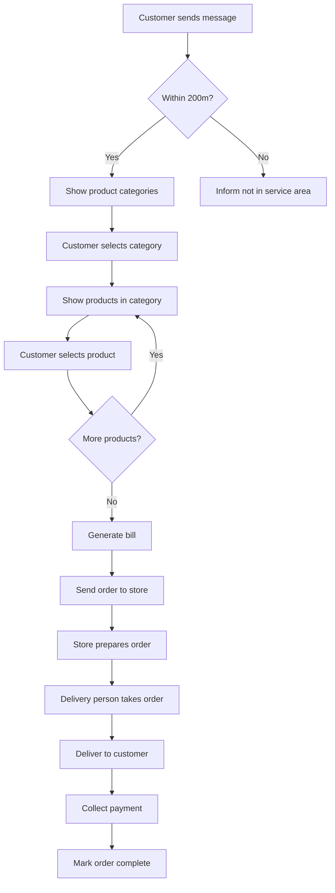

# wp-delivery-bot

Certainly! I'll add a flowchart using Mermaid to visualize the order process. Here's an updated version of the README.md with a Mermaid flowchart included:

```markdown
# LocalShop WhatsApp Bot

## Overview

LocalShop WhatsApp Bot is a hyper-local delivery solution that connects customers with nearby stores (within a 200-meter radius) through a WhatsApp-based ordering system. This project aims to streamline the ordering process for local general stores, allowing customers to browse products, place orders, and receive deliveries without the need for phone calls or in-person visits.

## Features

- WhatsApp-based ordering system
- Category and product navigation
- Automated bill generation
- Geofencing (200-meter radius limit)
- Order notifications for shops
- Basic analytics for store owners

## Order Process Flowchart



## Tech Stack

- Backend: Node.js / Python
- Database: MongoDB / Firebase Realtime Database
- WhatsApp Business API
- Geocoding: OpenStreetMap Nominatim API

## Setup

1. Clone the repository:
   ```
   git clone https://github.com/yourusername/localshop-whatsapp-bot.git
   cd localshop-whatsapp-bot
   ```

2. Install dependencies:
   ```
   npm install
   ```
   (or `pip install -r requirements.txt` if using Python)

3. Set up environment variables:
   Create a `.env` file in the root directory and add the following:
   ```
   WHATSAPP_API_KEY=your_api_key
   DATABASE_URL=your_database_url
   ```

4. Run the application:
   ```
   npm start
   ```
   (or `python app.py` if using Python)

## Configuration

- Update the `config.json` file with your store's categories and products.
- Adjust the geofencing radius in `settings.js` if needed.

## Contributing

We welcome contributions to the LocalShop WhatsApp Bot project. Please read our [Contributing Guidelines](CONTRIBUTING.md) for more information on how to get started.

## License

This project is licensed under the MIT License - see the [LICENSE](LICENSE) file for details.

## Contact

For any queries or support, please contact [Your Name] at [your.email@example.com].

## Roadmap

- [ ] Implement multi-store support
- [ ] Add advanced analytics dashboard
- [ ] Develop inventory management system
- [ ] Create a white-label version

## Acknowledgements

- [WhatsApp Business API](https://www.whatsapp.com/business/api)
- [OpenStreetMap Nominatim](https://nominatim.org/)
- [Node.js](https://nodejs.org/) / [Python](https://www.python.org/)
- [MongoDB](https://www.mongodb.com/) / [Firebase](https://firebase.google.com/)
```
